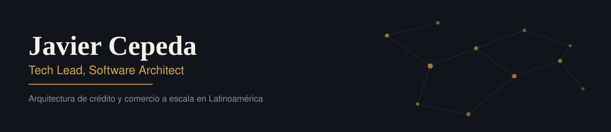

Tech Lead en el área de **Credits** de **MercadoLibre**, donde diseño arquitecturas escalables para democratizar el comercio y el acceso al crédito en Latinoamérica. Trabajo principalmente con **Java EE, Spring Boot, Golang y Python**, e integro **IA generativa a lo largo de todo el ciclo de vida de desarrollo de software** — diseño, código, testing, documentación y revisión. Actualmente curso una **maestría en Inteligencia Artificial**, y fuera del rol sigo de cerca machine learning, IA aplicada y arquitectura de software.

English version

 

Tech Lead on the **Credits** team at **MercadoLibre**, designing scalable architectures that democratize commerce and access to credit across Latin America. I work primarily with **Java EE, Spring Boot, Golang and Python**, and bring **generative AI into every stage of the software development lifecycle** — design, coding, testing, documentation and review. I'm currently pursuing a **Master's degree in Artificial Intelligence**, and outside the role I follow machine learning, applied AI and software architecture closely.

### Stack técnico

| Área | Tecnologías |
|---|---|
| Backend |     |
| Cloud & Infraestructura |     |
| Data |     |
| GenAI & IA |     |
| Frontend (soporte) |    |
| Apps móviles |   |

### GitHub

<table>
<tr>
<td></td>
<td></td>
</tr>
</table>

Conectemos en [LinkedIn](https://www.linkedin.com/in/jhavierc/).
